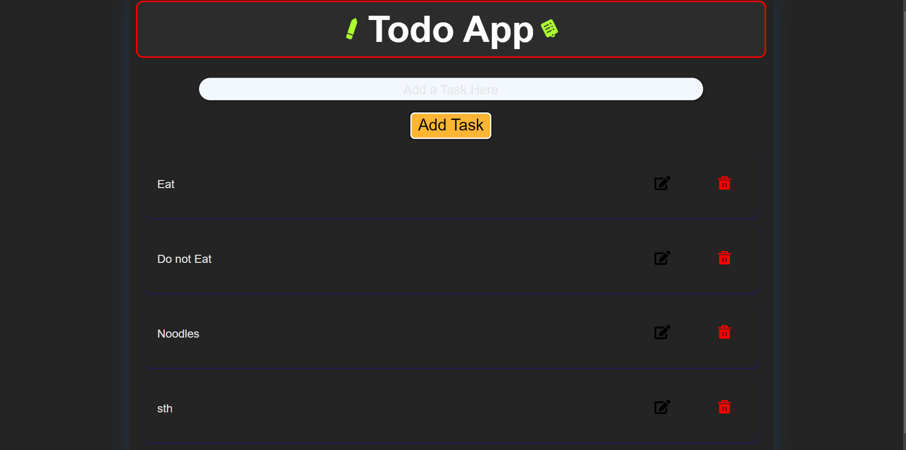
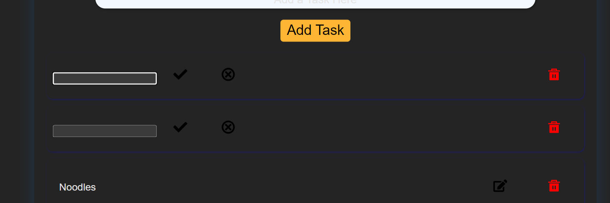
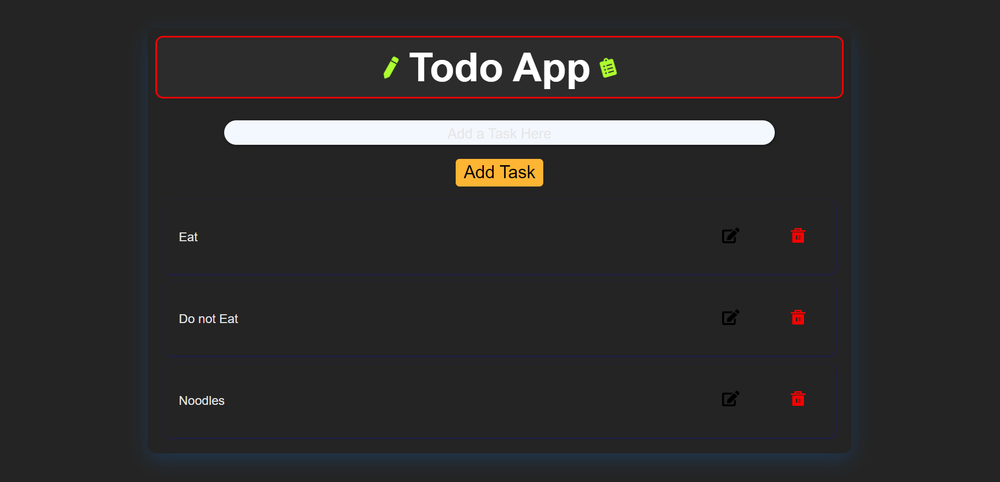
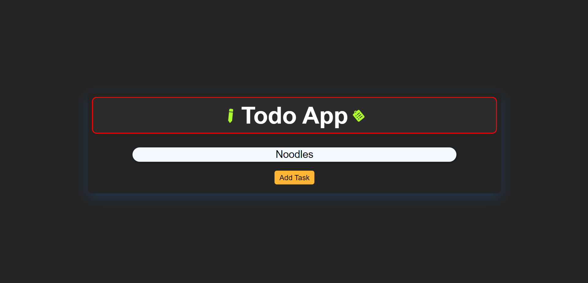

# Todo App: Task 4

This project is a simple Todo application built using React, TypeScript, and Vite. It allows users to add, remove, and manage(edit) tasks.

## Features

- Add a new task to the list by entering the task name and clicking the "Add Task" button or pressing the Enter key.
- Remove the last task in the list by clicking the "Remove Last Task" button.
- Remove a specific task by entering the task name and clicking the "Remove Task by Name" button.
- Click on a task in the list to remove it.

## Project Structure

- `index.html`: The HTML file that contains the structure of the task list application.
- `src/main.tsx`: The main entry point for the React application.
- `src/todo.ts`: TypeScript file that defines the TodoItem interface and implements functions to add, remove, and display todo items.
- `vite.config.ts`: Vite configuration file.

## Installation

1. **Clone the Repository**:

   ```sh
   git clone <repository-url>
   ```

2.Navigate to the Project Directory:

  ```sh
   cd <project-directory>
   ```

3.Install Dependecies:

  ```sh
   npm install
   ```

## Running the Project

1.Start the Development Server:

  ```sh
   npm run dev
   ```

2.Open the Application:

Open your browser and navigate to <http://localhost:5173/>.

## Example

Here is an example of how the application looks:

### Todo App Example






## ESLint Configuration

This project uses ESLint for linting. To configure ESLint for React, you can use the eslint-plugin-react and update the config:

```js
// eslint.config.js
import react from 'eslint-plugin-react'

export default tseslint.config({
  // Set the react version
  settings: { react: { version: '18.3' } },
  plugins: {
    // Add the react plugin
    react,
  },
  rules: {
    // other rules...
    // Enable its recommended rules
    ...react.configs.recommended.rules,
  },
})
```
